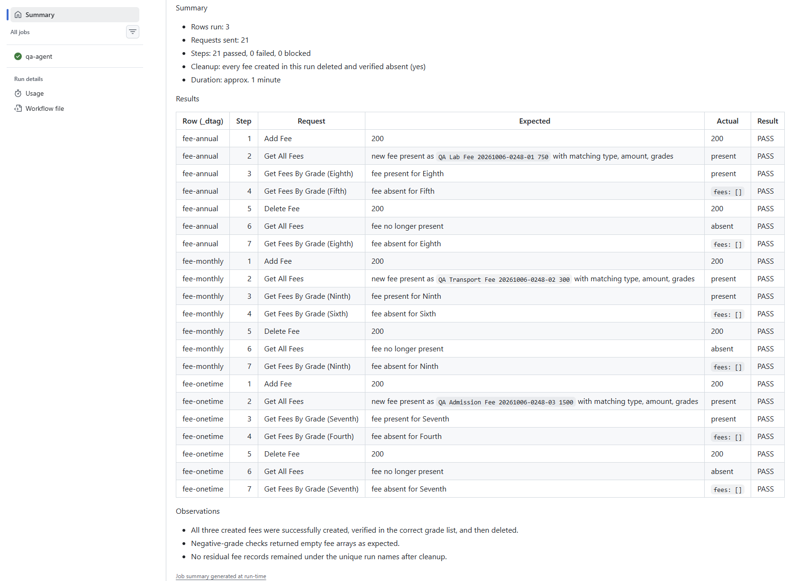

# AI QA Agent for API Regression (Postmate + GitHub Copilot)

An AI agent that runs API regression tests from **plain-English scenarios**, with
**no test scripts**. It sends real requests through [Postmate Client](https://www.postmateclient.com)
saved requests and reports a PASS / FAIL / BLOCKED table. It runs in VS Code and,
headless, in GitHub Actions.

The target is a demo School API (fees). Read the full story in the blog post:
[How I Built an AI QA Agent for API Regression and Other Testing Tasks](https://www.postmateclient.com/blog/ai-qa-agent-api-regression).

## How it works

```
Scenario (plain English, in a skill file)
        │
        ▼
GitHub Copilot agent ──MCP──► Postmate MCP server ──► Saved requests ──► School API
 (VS Code or Copilot CLI)      (VS Code extension,      (collection +
                                or `pmc mcp` in CI)      data table)
```

- The **skill file** holds application knowledge, test data rules and the scenarios.
- The **agent file** holds the agent's rules (only saved requests, clean up, never guess).
- The agent can only send requests that already exist in the Postmate collection.
  It cannot invent URLs or change saved requests.
- Every run creates its own uniquely named data and deletes it again.

## Repository layout

```
.github/
  agents/school-qa-agent.agent.md   Copilot custom agent (rules)
  skills/school-api/SKILL.md        App knowledge, data rules, scenarios, report format
  workflows/qa-agent.yml            GitHub Actions workflow (manual trigger)
.postmate/
  collections/School API.json       Saved requests (Login, Add Fee, Get All Fees, ...)
  data/School-Fee.csv               Test data, one row per fee type
  postmate-envs.json                QA environment (the password is a secret, not stored)
ci/
  mcp.json                          MCP server config for Copilot CLI (`pmc mcp`)
```

## Run it in VS Code

1. Install [Postmate Client](https://marketplace.visualstudio.com/items?itemName=postmate-lab.postmate)
   and open this folder.
2. In Settings, turn on `postmate.mcp.enabled` and `postmate.mcp.allowSend`.
   Keep `postmate.mcp.confirmMutations` on if you want to approve every POST/DELETE.
3. Set the `__password` secret for the QA environment in the Postmate environment panel.
4. In Copilot Chat (Agent mode), select **school-qa-agent** and type:

   ```
   Run fee regression.
   ```

> After changing an MCP setting, start a new chat. The agent remembers earlier turns
> and may assume a tool is still unavailable.

## Run it headless (Copilot CLI)

```bash
npm install -g @postmate/cli @github/copilot
export POSTMATE_SECRET___PASSWORD='<password>'

copilot -p "Run fee regression." \
  --agent school-qa-agent \
  --additional-mcp-config @ci/mcp.json \
  --allow-all-mcp-server-instructions \
  --disable-builtin-mcps \
  --allow-all-tools \
  --deny-tool shell --deny-tool write \
  --excluded-tools sql \
  --no-ask-user \
  --share reports/qa-run.md
```

`pmc mcp` starts the Postmate MCP server over stdio. `--env QA` picks the environment
and `--allow-mutations` allows POST/PUT/DELETE (blocked by default).

## Run it in GitHub Actions

The workflow in `.github/workflows/qa-agent.yml` is manual only (**Actions → AI QA
agent - fee regression → Run workflow**), because a run creates real data and uses
Copilot credits.

Add two repository secrets (**Settings → Secrets and variables → Actions**):

| Secret | Value |
|---|---|
| `COPILOT_GITHUB_TOKEN` | Fine-grained personal access token. Resource owner: your personal account. **Permissions → Account → Copilot Requests: Read**. Classic tokens and the built-in `GITHUB_TOKEN` do not work. |
| `SCHOOL_API_PASSWORD` | Password for the School API test account |

Each run:
- writes the report table to the job summary,
- uploads `reports/` as the `qa-agent-report` artifact,
- fails the job unless the report says `0 failed, 0 blocked`.



## Safety

| Layer | What it does |
|---|---|
| Saved requests only | The agent cannot call URLs that are not in the collection |
| Mutation policy | POST/PUT/DELETE need approval in VS Code, or `--allow-mutations` in CI. Enforced by Postmate, not by the model |
| Secrets | The password lives in a secret variable, never in the repo |
| Redaction | Tokens, passwords and auth headers are redacted before the agent sees a response |
| Tool limits | In CI the agent cannot run shell commands or write files |
| Stop rule | A missing credential or 401/403 stops the run as BLOCKED. The agent never goes looking for credentials |

## Cost

A full run (3 data rows, 21 steps) costs roughly **1 to 2.5 cents** in GitHub AI
credits, depending on the model Copilot picks. A blocked run stops early and costs
less than a cent.

## Using it with your own API

The School API credentials are not shared, so to try this end to end, point it at
your own API:

1. Create a Postmate collection with your saved requests and a data table.
2. Copy `SKILL.md` and replace the application knowledge, data rules and scenarios
   with your own.
3. Adjust the agent file and `ci/mcp.json` (environment name), then run.

## Links

- [Postmate Client](https://www.postmateclient.com): privacy-first, local-first API client for VS Code
- [`@postmate/cli`](https://www.npmjs.com/package/@postmate/cli): `pmc run` and `pmc mcp`
- [Blog post](https://www.postmateclient.com/blog/ai-qa-agent-api-regression)